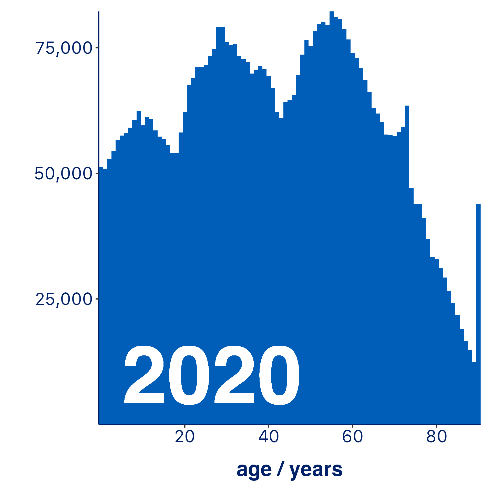
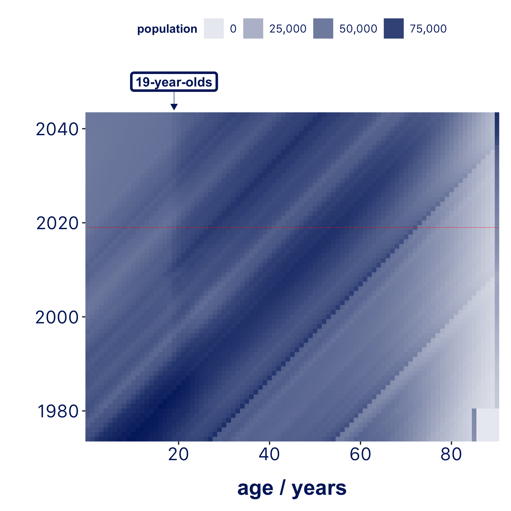
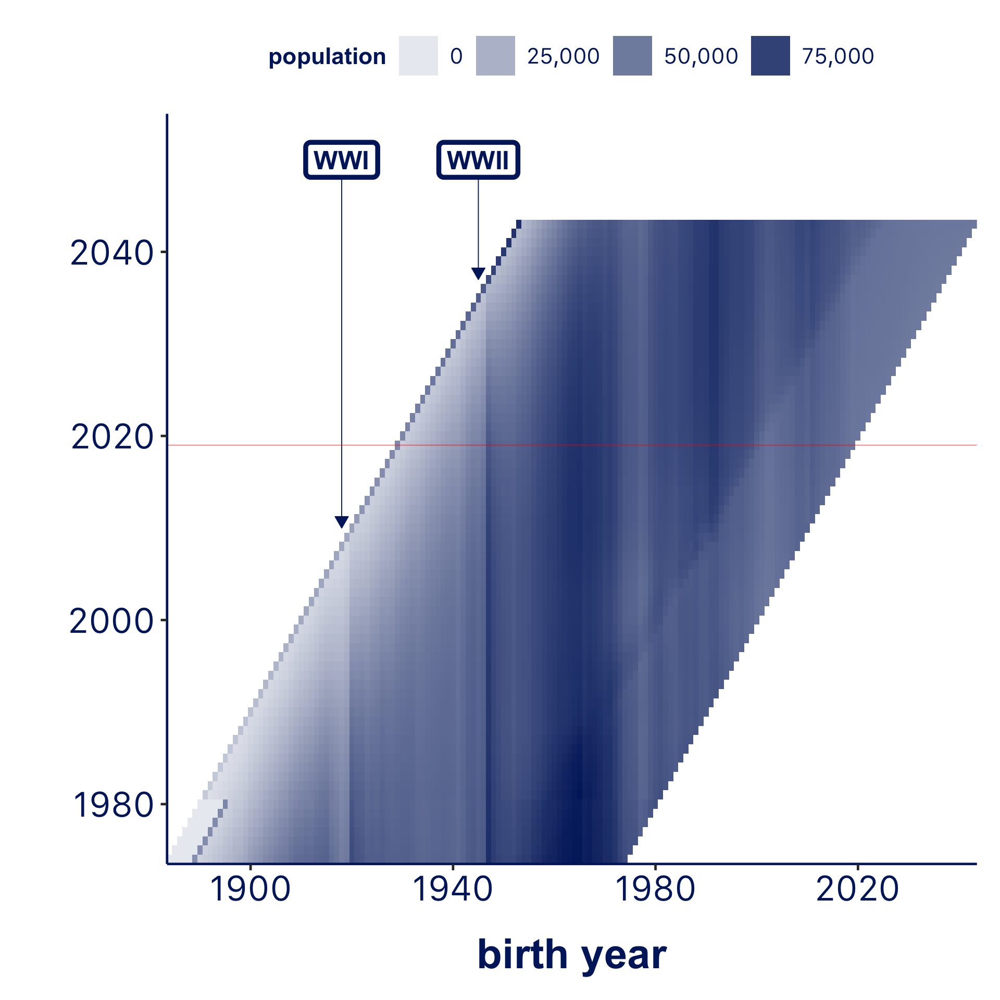
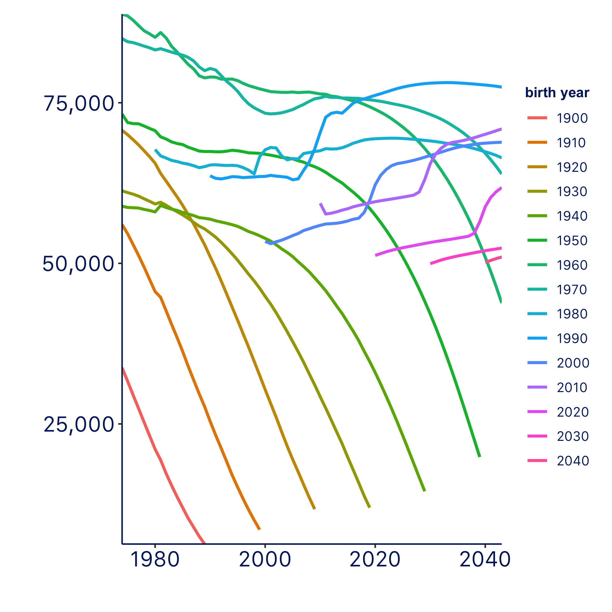
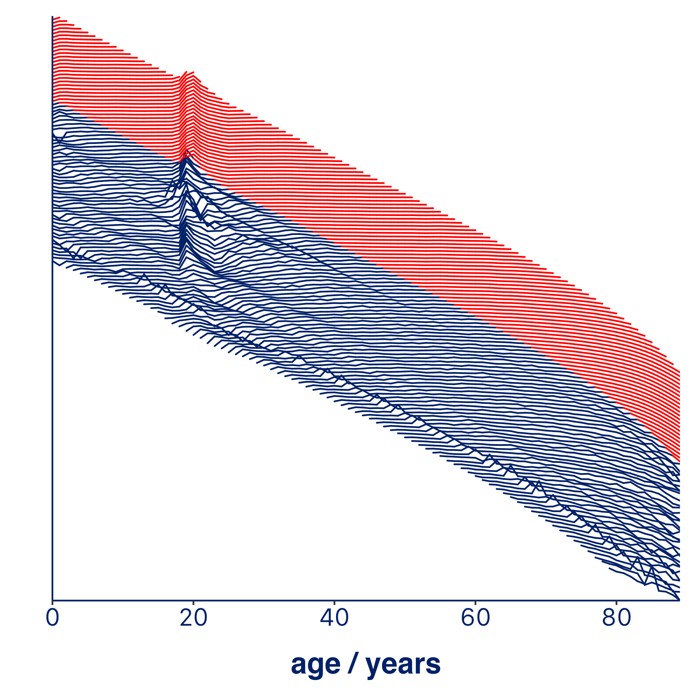

# NRS Populations Data Visualisations

Some data visualisations created from [NRS](https://www.nrscotland.gov.uk) population data (estimates and projections), using [R](https://www.r-project.org) and [ggplot](https://ggplot2.tidyverse.org). Data was obtained from NHS Scotland's [CKAN](https://ckan.org) [OpenData](https://www.opendata.nhs.scot) portal, using [ckanr](https://github.com/ropensci/ckanr). Animation were produced using [gganimate](https://github.com/thomasp85/gganimate). Code can be found [here](NRS_populations_viz.R).

## Age Distribution | 2020

## Animated Age Distribution | 1974 -- 2043

## Population Age Distribution Heatmap

## Population Birth Year Distribution Heatmap

## Decadal Birth Year Population Curves

## Animated Annual Relative Change in Population, by Birth Year
(note: red is projected data)

## Unknown Pleasures Ripoffs
Inspired by the [famous](https://blogs.scientificamerican.com/sa-visual/pop-culture-pulsar-origin-story-of-joy-division-s-unknown-pleasures-album-cover-video/) [pulsar](https://en.wikipedia.org/wiki/PSR_B1919%2B21) timing chart / Joy Division album [cover](https://www.google.com/search?q=unknown+pleasures&bih=837&biw=1440&hl=en-GB&sxsrf=ACYBGNTyRWgVql-yZuNNQVfS3d7hamRTBg:1577980303072&source=lnms&tbm=isch&sa=X&ved=2ahUKEwj7-bTbouXmAhVoQEEAHVHCA7QQ_AUoAXoECBEQAw).

Same data as animated plot above, but stacked vertically rather than animated.

Finally, a more stylised version of the above.

